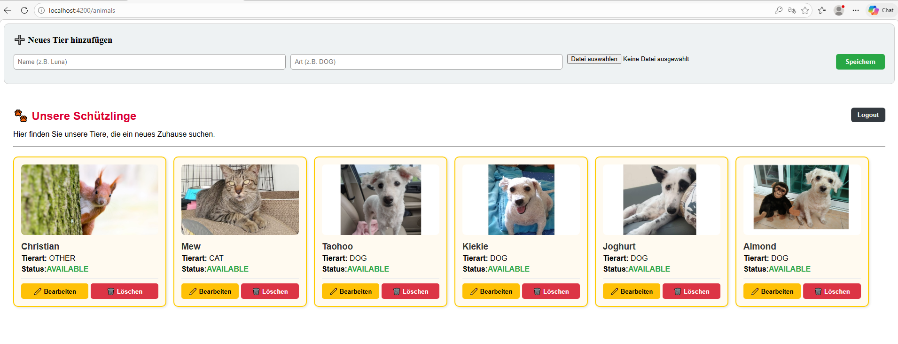
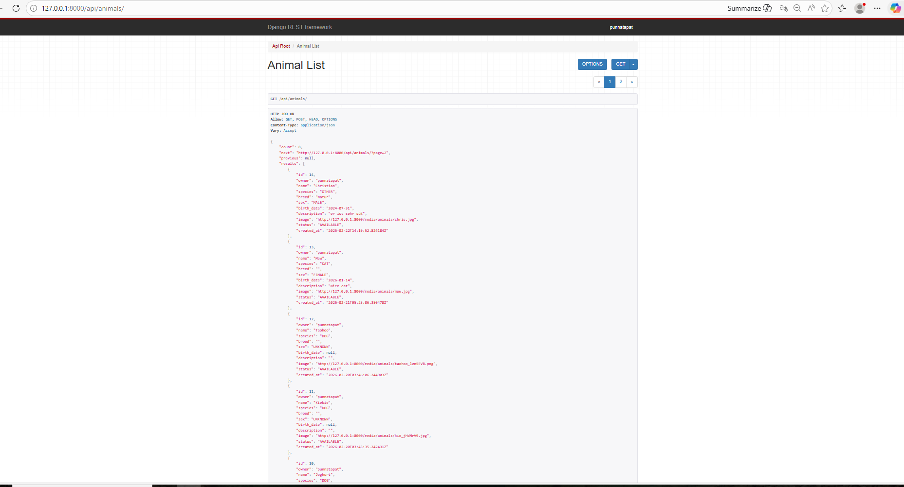

# 🐾 AnimalCare Frontend (Angular v19)

[](https://angular.dev/)
[](https://github.com/YOUR-USERNAME/animalcare-frontend)

Willkommen bei **AnimalCare**!  
Dies ist das moderne Frontend-System für unsere Tiervermittlungsplattform, entwickelt mit der neuesten **Angular v19** Technologie.

---

# 📸 Project Preview

### 🖥️ Frontend (Angular)



### ⚙️ Backend API (Django REST Framework)



---

## ❤️ Inspiration

Dieses Projekt ist von meinen vier geliebten Hunden **(Almond🐶, Joghurt🐶, Taohoo🐶 und Kiekie🐶)** inspiriert.
Auch wenn sie heute nicht mehr bei mir sind, wollte ich ihnen mit dieser kleinen Anwendung ein persönliches Andenken widmen und Lernen mit etwas Bedeutungsvollem verbinden.

---

## ✨ Highlights

- **Deutsche Benutzeroberfläche:** Vollständig lokalisiert für eine klare Kommunikation.
- **Modernes Framework:** Erstellt mit der neuesten **Angular v19** Technologie.
- **Zoneless Change Detection:** Maximale Performance durch `provideZonelessChangeDetection()`.
- **Angular Signals:** Reaktive Datenverwaltung für sofortige UI-Updates.
- **Full CRUD Integration:** Anzeigen (GET), Hinzufügen (POST), Bearbeiten (PUT) und Löschen (DELETE) von Tierdaten.

---

## 🛠️ Tech Stack

- **Core:** [Angular 19](https://angular.dev/)
- **State Management:** Angular Signals
- **Kommunikation:** HttpClient (RxJS) & REST API
- **Backend-Anbindung:** Django REST Framework (Port 8000)

---

## 📜 Update-Historie (Roadmap & Erfolge)

### 26.02.2026 – Cloudinary Integration & Pagination Stabilisierung

- Cloudinary Image Hosting integriert (statt lokalem media-Storage)
- Frontend nutzt korrekt image_url zur Darstellung externer Bilder
- Rendering-Bug behoben (animal.image → animal.image_url)
- JWT Routing Problem im Backend behoben (/api/token/ stabil)
- Pagination-Verhalten analysiert (PAGE_SIZE = 6)
- End-to-End Test erfolgreich: Login → Upload → Anzeige → Edit → Delete

### ✅ **24.02.2026 – Auth Stabilisierung + Interceptor Ready + UI Feinschliff**

- **[Security] HTTP Interceptor Ready**: Vorbereitung/Integration, um `Authorization: Bearer <token>` automatisch bei API-Requests mitzuschicken.
- **[Fix] 403 Forbidden gelöst**: Bearbeiten/Upload für bestehende Tiere funktioniert nach Owner-Daten-Fix im Backend zuverlässig.
- **[UI] Bilddarstellung verbessert**: Einheitliche Card-Optik durch feste Bildhöhe + `object-fit: cover` (keine verzerrten Bilder).
- **[Routing] Login Flow stabil**: Login → Redirect zu `/animals`, Logout → Redirect zu `/login`.
- **[Validation] End-to-End Test**: CRUD + Image Upload + Anzeige vollständig im Browser getestet.

### ✅ **23.02.2026 – Image Upload Integration & Owner-Permission Stabilisierung**

- **[New Feature] Image Upload UI**: Integration eines Datei-Inputs (`type="file"`) für Tierbilder.
- **[HTTP] Multipart/FormData Support**: Anpassung der `POST`- und `PUT`-Requests zur Unterstützung von Bild-Uploads.
- **[Image Rendering] Dynamische Bildanzeige**: Implementierung von `getImageUrl()` zur sicheren Verarbeitung relativer & absoluter Media-URLs.
- **[Fallback-Logik]** Anzeige von Emoji-Icons nur wenn kein Bild vorhanden ist.
- **[Bugfix] 403 Forbidden Debugging**: Analyse und Lösung von Update-Problemen in Kombination mit Object-Level Permissions.
- **[UX] Verbesserte Kartenansicht**: Optimierung von `object-fit: cover`, einheitliche Bildhöhen & saubere Card-Struktur.
- **[Data Consistency] Owner-Fix Synchronisation**: Frontend erfolgreich mit korrigierten Backend-Daten (Owner-Zuweisung) getestet.

### ✅ **22.02.2026 – JWT Login, Route-Protection & Frontend-Stabilisierung**

- **[New Feature]** **JWT Login-System** integriert (Django SimpleJWT) – Login über `/api/token/`.
- **[AuthService]** Neuer `AuthService` zum Abrufen von **Access/Refresh Token**.
- **[Security]** Speicherung der Tokens im `localStorage` (`access_token`, `refresh_token`).
- **[Routing]** Saubere Trennung der Seiten: **/login** und **/animals**.
- **[New Feature]** **AuthGuard (Route Protection)**: Zugriff auf `/animals` nur mit gültigem Token – ohne Token erfolgt Redirect zu `/login`.
- **[Bugfix]** **Double-Render Problem** behoben (Komponente wurde doppelt gerendert) durch korrekte Nutzung von `<router-outlet>`.
- **[Refactoring]** Anpassungen für Angular 19 (Strict Mode / Typisierung / DI-Fixes).

### ✅ **20.02.2026 - Das Full CRUD Update**

- **[New Feature]** **Bearbeitungsmodus (Edit)**: Implementierung der `PUT`-Methode zum Aktualisieren von Tierdaten.
- **[Logic]** Einführung von `editingAnimalId` Signals zur Steuerung zwischen Erstellungs- und Bearbeitungsmodus.
- **[UI/UX]** Dynamische Formular-Header und "Abbrechen"-Funktion für eine bessere Benutzerführung.
- **[Refactoring]** Umstellung auf `inject(HttpClient)` für modernen Angular v19 Standard.

### ✅ **19.02.2026 - Durchbruch & Stabilisierung**

- **[Fixed]** Fehler **TS2724** behoben: Umstellung auf die stabile `provideZonelessChangeDetection`.
- **[New Feature]** **Löschfunktion**: Implementierung des "Löschen"-Buttons mit `signals.update` für Echtzeit-Feedback.
- **[UI]** Optimierung der Kartenansicht (Cards) und Integration der DELETE-Methode.

### ✅ **18.02.2026 - Signal-Migration**

- **Angular Signals**: Umstellung auf `signal<any[]>([]);` für die Tierliste.
- **Dynamic Icons**: Emojis für CAT, DOG und RABBIT implementiert.

### ✅ **17.02.2026 - Full-Stack Integration**

- **API-Anbindung**: Erste erfolgreiche Datenübertragung vom Django REST Framework.
- **Bugfixes**: Fehler "NG0908" (Zone.js) und Probleme mit der JSON-Struktur (`results`) behoben.

### ✅ **Frühere Meilensteine**

- [x] Angular v19 Grundgerüst & Setup
- [x] Deutsche Lokalisierung (UI)
- [x] animal-list Komponenten-Architektur

---

## 📊 Nächste Schritte

- [x] Meilenstein 5: JWT Authentifizierung & Login-System ✅
- [x] Route Protection (AuthGuard) ✅
- [x] Image Upload (Development Environment) 📸 ✅
- [ ] HTTP Interceptor (Bearer Token automatisch mitsenden) 🔐
- [ ] Logout-Button + Session Handling (Refresh/Auto-Login) 🚪
- [ ] Token Refresh (Auto-Refresh bei 401) ♻️

---

## 📦 Installation & Start

```bash
# Repository klonen
git clone [https://github.com/YOUR-USERNAME/animalcare-frontend.git](https://github.com/YOUR-USERNAME/animalcare-frontend.git)
cd animalcare-frontend

# Abhängigkeiten installieren
npm install

# Frontend starten
ng serve
```
